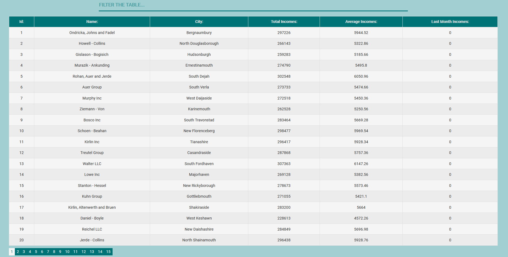

# Companies Table
Companies table created in React using: TypeScript, API, Hooks, Styled-Components, HTML, CSS. This project was bootstrapped with Create React App. The application works on desktop, mobile and tablet devices.
## Table of contents
* [General info](#general-info)
* [Screenshots](#screenshots)
* [Technologies](#technologies)
* [Setup](#setup)
* [Features](#features)
* [Status](#status)
* [Contact](#contact)

## General info
The project contains detailed information about company's incomes, i.e. 'id, name, city, total income, average income, last month income'. The purpose of the project is to get a job and acquire new skills in the front-end technologies.

## Screenshots

### Application view:


### Reponsive view:


## Technologies
* npm - version 6.14.4
* react/react-dom - version 16.13.1
* node - version 14.0.0
* axios - version 0.19.2

## Setup

### Download the source code use:
```
git clone https://github.com/mateuszdobija97/Companies.git
```

### Install npm and axios use:
```
npm install
npm i axios
npm install styled-components
```

### Run the server:
```
npm start
```

## Features

### List of features:
* Data display (id, name, city, total income, average income, last month income)
* Sorting data (click on a column: first click - ascending, second click - descending)
* Data search (can filter the result of the table by all fields)
* Paginated table (20 data per page)
* Responsive view (The application works on breakpoints: 360x640 ++)

## Status
Project is finished.

## Contact
#### E-mail: mateusz.dobija.rce@gmail.com
#### Linkedin: https://www.linkedin.com/in/mateusz-dobija-9278a71a9/

##### Created by Mateusz Dobija
